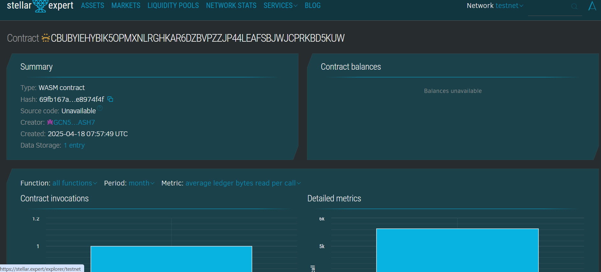

# Fixed Price Auction Smart Contract

## 📜 Project Description
This smart contract implements a simple fixed price auction model on the Soroban smart contract platform. It allows sellers to list items for a set price, and buyers to purchase them directly without bidding.

## 🌍 Project Vision
To enable quick, secure, and transparent transactions between buyers and sellers using a fixed-price mechanism, minimizing auction complexity and ensuring immediate purchases on Stellar-based decentralized applications.

## 🌟 Key Features
- **List Items**: Sellers can list their item with a fixed price.
- **Buy Now**: Buyers can directly purchase items at the listed price.
- **No Bidding War**: Eliminates delays and bidding battles typical in traditional auctions.
- **State Persistence**: Each transaction updates the item's status securely on-chain.

## 🔮 Future Scope
- Integrate payment handling using Stellar native assets or tokens.
- Add escrow system for added transaction safety.
- Support for item categories and search filters.
- Event logging and analytics for auction tracking.
- Enable seller and buyer feedback/rating system.

## contract details
CBUBYIEHYBIK5OPMXNLRGHKAR6DZBVPZZJP44LEAFSBJWJCPRKBD5KUW
